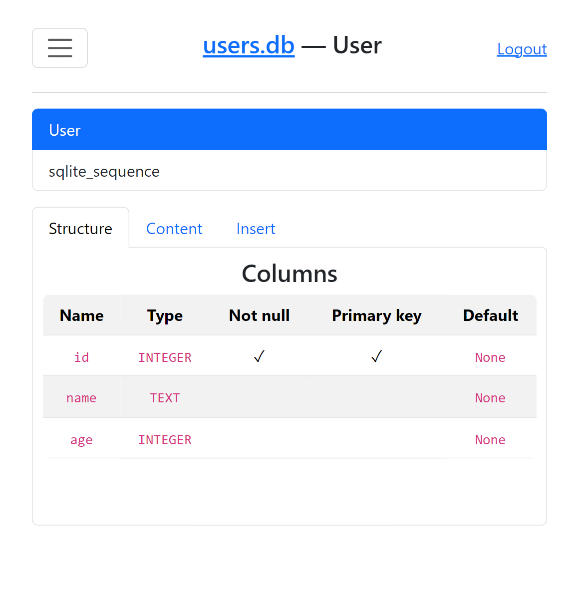

# DB Navigator
### DataBase Navigator for Flask




### Usage:
```python
from flask import Flask
from db_navigator import DBNavigator

app = Flask(__name__)
DBNavigator(app, "users.db", prefix="/admin", password="1234")

app.run(debug=True)
```
